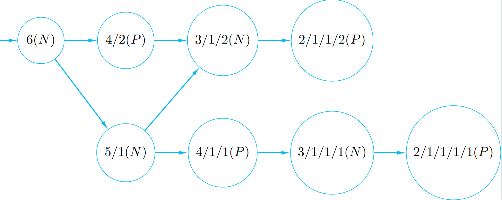
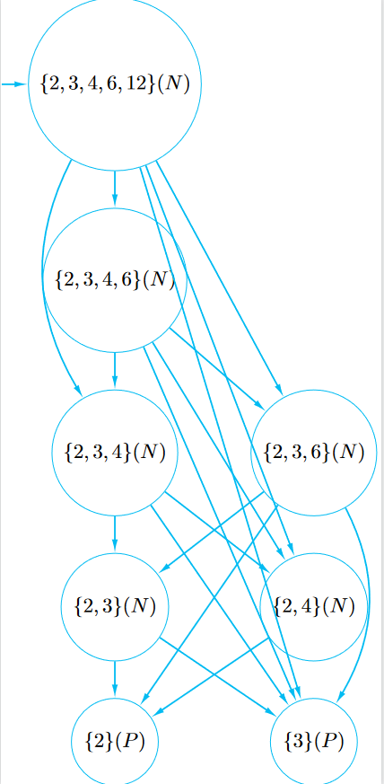

# (1)
Grundy's game is defined as follows. The starting position is some number of piles of berries. A move consists of taking one pile of berries, and dividing it into two non-empty piles of unequal sizes. For example, a pile of size 4 can only be split into 1/3, whereas a pile of 5 can be split either as 1/4 or as 2/3. The person who can't make a move loses: at this point, the game board will only have piles of size 1 or 2.\
Draw the game graph starting at the position 6, labelling each position as either N or P. Consider the piles to be unordered; that is, a position such as (1,4) is considered to be the same as the position (4,1).\
No justification is required.

---

# (2)
Recall poset chomp. We start with finite poset $S$. A move consists of removing an $a\in S$ together with all $b\in S$ with $a\preceq b$.\
Let $S$ be the divisor poset of 12 except the integer 1. So $S=\{2,3,4,6,12\}$ and $a\preceq b$ if $a$ divides $b$.\
Using strategic labeling on the game graph, determine if the following positions are N or P

---

## (a)
$\{3\}$

---
P
## (b)
$\{2,4\}$

---
N
## (c)
$\{2,3,4\}$

---
N
## (d)
$\{2,3,4,6,12\}$

---
N
# (3)
Determine if the following nim games are P or N.

---
- A nim state is a P-state if and only if it has zero nim-sum, and an N-state if and only if it has positive nim-sum (theorem 71).
- The nim-sum of two non-negative integers $m$ and $n$, denoted $m\oplus n$, is the bitwise XOR of their binary representations,
## (a)
$\text{Nim}(3,4,5)$

---
$$
\begin{align*}
3\oplus4\oplus5&=011_2\oplus100_2\oplus101_2\\
&=010_2\\
\therefore&\text{ Nim}(3,4,5)\text{ is an N state}
\end{align*}
$$
## (b)
$\text{Nim}(m,m,n)$ where $m,n>0$.

---
$$
\begin{align*}
m\oplus m\oplus n&=0\oplus n\\
&\ge1_2\\
\therefore&\text{ Nim}(m,m,n)\text{ is an N state}
\end{align*}
$$
## (c)
$\text{Nim}(m,m,m,m)$ where $m>0$.

---
$$
\begin{align*}
m\oplus m\oplus m\oplus m&=0\oplus0\\
&=0\\
\therefore&\text{ Nim}(m,m,m,m)\text{ is an P state}
\end{align*}
$$
## (d)
$\text{Nim}(m,n)$ where $m\neq n$.

---
$$
\begin{align*}
m\oplus n&\ge1_2\\
\therefore&\text{ Nim}(m,n)\text{ is an N state}
\end{align*}
$$
## (e)
$\text{Nim}(m,2m,4m,8m)$ where $m>0$.

---
$$
\begin{align*}
m\oplus 2m\oplus 4m\oplus 8m&\ge1_2\\
\therefore&\text{ Nim}(m,2m,4m,8m)\text{ is an N state}
\end{align*}
$$
# (4)
The game of nimble is played on a line of squares $0,1,2,3,...$. There are $n$ coins placed on the squares, with perhaps more than one coin on a single square. A move consists of taking one of the coins and moving it to any square on the left, possibly onto a square already one or more coins. The players alternate moves and the games end when all coins are on the square labelled $0$.
## (b)
Suppose the coins are intially placed on the squares $4,8,11$. This is an $N$ position. Find all possible winning moves. Express your answer as a triple $(a,b,c)$ denoting the positions of the coins. For example, $(3,8,11)$ is a valid move. And so is $(4,0,11)$, but not $(3,0,11)$.

---
This game state is equivalent to $\text{Nim}(4,8,11)$.\
To win the game, the move must end with a nim-sum of $0$.
$$
\begin{align*}
4\oplus 8\oplus 11\oplus&=0100_2\oplus1000_2\oplus1011_2\\
\text{solution involving moving coin }&1:\\
x\oplus1000_2\oplus1011_2&=0,x\lt0100_2\\
x\oplus11_2&=0\\
x&=11_2\\
&=3\\
\text{solution involving moving coin }&2:\\
0100_2\oplus x\oplus1011_2&=0,x\lt1000_2\\
x\oplus 0100_2\oplus1011_2&=0\\
x\oplus 1111_2&=0\\
x&=1111_2\\
\therefore\text{ no winning move as }1111_2&\gt1000_2\\
\text{solution involving moving coin }&3:\\
0100_2\oplus1000_2\oplus x&=0,x<1011_2\\
1100_2\oplus x&=0\\
x&=1100_2\\
\therefore\text{ no winning move as }1100_2&\gt1011_2\\
\end{align*}
$$
$\therefore$ The only winning move is $(3,8,11)$