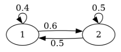
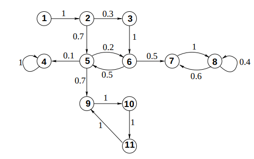
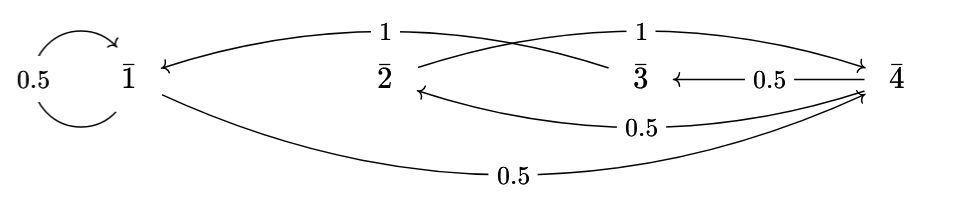

# (1) Consider the following Markov chain:

## (a) What is the probability of transitioning from 1 to 1 after 2 steps.
$$
\begin{align*}
A&=\begin{bmatrix}
0.4&0.6\\
0.5&0.5
\end{bmatrix}\\
A^2&=\begin{bmatrix}
0.46&0.54\\
0.45&0.55
\end{bmatrix}\\
A^2_{1,1}&=0.46
\end{align*}
$$

## (b) Find $\lim_{k\to\infty}A^k$
$$
\begin{align*}
A&=\begin{bmatrix}
0.4&0.6\\
0.5&0.5
\end{bmatrix}\\
\text{Let }D&=E^{-1}AE\tag{1}\\
(\lambda I-A)v&=0\tag{2}\\
\det(\lambda I-A)&=0\\
\det\begin{pmatrix}
\lambda-0.4&-0.6\\
-0.5&\lambda-0.5
\end{pmatrix}&=0\\
(\lambda-0.4)(\lambda-0.5)-(-0.5)(-0.6)&=0\\
\lambda^2-0.9\lambda+0.2-0.3&=0\\
\lambda^2-0.9\lambda-0.1&=0\\
(\lambda+0.1)(\lambda-1)&=0\\
\lambda&=-0.1,1\\
D&=\begin{bmatrix}
-0.1&0\\
0&1
\end{bmatrix}\tag{3}\\
\begin{bmatrix}
\lambda-0.4&-0.6\\
-0.5&\lambda-0.5
\end{bmatrix}v&=0\tag*{from (2)}
\end{align*}\\
\begin{align*}
\begin{bmatrix}
-0.1-0.4&-0.6\\
-0.5&-0.1-0.5
\end{bmatrix}v&=0&
\begin{bmatrix}
1-0.4&-0.6\\
-0.5&1-0.5
\end{bmatrix}v&=0\\
\begin{bmatrix}
-0.5&-0.6\\
-0.5&-0.6
\end{bmatrix}v&=0&
\begin{bmatrix}
0.6&-0.6\\
-0.5&0.5
\end{bmatrix}v&=0\\\begin{bmatrix}
-0.5&-0.6\\
-0.5&-0.6
\end{bmatrix}\begin{bmatrix}
v_x\\v_y
\end{bmatrix}&=0&
\begin{bmatrix}
0.6&-0.6\\
-0.5&0.5
\end{bmatrix}\begin{bmatrix}
v_x\\v_y
\end{bmatrix}&=0\\
\begin{bmatrix}
-0.5&-0.6\\
-0.5&-0.6
\end{bmatrix}\begin{bmatrix}
-6\\5
\end{bmatrix}&=0&
\begin{bmatrix}
0.6&-0.6\\
-0.5&0.5
\end{bmatrix}\begin{bmatrix}
1\\1
\end{bmatrix}&=0
\end{align*}\\
\begin{align*}
v&=\begin{bmatrix}-6\\5\end{bmatrix},\begin{bmatrix}1\\1\end{bmatrix}\\
E&=\begin{bmatrix}-6&1\\5&1\end{bmatrix}\tag{4}\\
\begin{bmatrix}
-0.1&0\\
0&1
\end{bmatrix}&=\begin{bmatrix}-6&1\\5&1\end{bmatrix}^{-1}A\begin{bmatrix}-6&1\\5&1\end{bmatrix}\tag*{sub (3),(4) into (1)}\\
A&=\begin{bmatrix}-6&1\\5&1\end{bmatrix}\begin{bmatrix}
-0.1&0\\
0&1
\end{bmatrix}\begin{bmatrix}-6&1\\5&1\end{bmatrix}^{-1}\\
\lim_{k\to\infty}A^k&=\lim_{k\to\infty}\left(\begin{bmatrix}-6&1\\5&1\end{bmatrix}\begin{bmatrix}
-0.1&0\\
0&1
\end{bmatrix}\begin{bmatrix}-6&1\\5&1\end{bmatrix}^{-1}\right)^k\\
&=\lim_{k\to\infty}\begin{bmatrix}-6&1\\5&1\end{bmatrix}\begin{bmatrix}
-0.1^k&0\\
0&1^k
\end{bmatrix}\begin{bmatrix}-6&1\\5&1\end{bmatrix}^{-1}\\
&=\begin{bmatrix}-6&1\\5&1\end{bmatrix}\begin{bmatrix}
0&0\\
0&1
\end{bmatrix}\begin{bmatrix}-6&1\\5&1\end{bmatrix}^{-1}\\
&=\begin{bmatrix}
0&1\\
0&1
\end{bmatrix}\begin{bmatrix}-6&1\\5&1\end{bmatrix}^{-1}\\
&\left[\begin{array}{cc|cc}-6&1&1&0\\5&1&0&1\end{array}\right]\tag*{compute inverse}\\
&\left[\begin{array}{cc|cc}-11&0&1&-1\\5&1&0&1\end{array}\right]\tag*{(1)-(2)}\\
&\left[\begin{array}{cc|cc}1&0&-\frac{1}{11}&\frac{1}{11}\\5&1&0&1\end{array}\right]\tag*{$\frac{(1)}{-11}$}\\
&\left[\begin{array}{cc|cc}1&0&-\frac{1}{11}&\frac{1}{11}\\0&1&\frac{5}{11}&\frac{6}{11}\end{array}\right]\tag*{(2)-5(1)}\\
\lim_{k\to\infty}A^k&=\begin{bmatrix}
0&1\\
0&1
\end{bmatrix}\begin{bmatrix}
-\frac{1}{11}&\frac{1}{11}\\
\frac{5}{11}&\frac{6}{11}
\end{bmatrix}\\
&=\begin{bmatrix}
\frac{5}{11}&\frac{6}{11}\\
\frac{5}{11}&\frac{6}{11}
\end{bmatrix}
\end{align*}
$$

# (2) Consider the Markov chain

$$
\begin{align*}
A&=\begin{bmatrix}
0&1&0&0&0&0&0&0&0&0&0\\
0&0&0.3&0&0.7&0&0&0&0&0&0\\
0&0&0&0&0&1&0&0&0&0&0\\
0&0&0&1&0&0&0&0&0&0&0\\
0&0&0&0.1&0&0.2&0&0&0.7&0&0\\
0&0&0&0&0.5&0&0.5&0&0&0&0\\
0&0&0&0&0&0&0&1&0&0&0\\
0&0&0&0&0&0&0.6&0.4&0&0&0\\
0&0&0&0&0&0&0&0&0&1&0\\
0&0&0&0&0&0&0&0&0&0&1\\
0&0&0&0&0&0&0&0&1&0&0
\end{bmatrix}
\end{align*}
$$
## (a) Does the Perron-Frobenius theorem apply?
No
## (b) Is the graph strongly connected?
No

## (c) 
Define a relation $\sim$ on the set of vertices by saying $v\sim w$ if\
(i) $v=w$ or\
(iii) there is a path from $v$ to $w$ and a path from $w$ to $v$\
Convince yourself that this is an equivalence relation. Write down the equivalence classes.

The equivalence classes are:
- $\{1\}$
- $\{2\}$
- $\{3\}$
- $\{4\}$
- $\{5,6\}$
- $\{7,8\}$
- $\{9,10,11\}$

# (3)
Let $S=\frac{\mathbb{Z}}{5\mathbb{Z}}-\{\bar0\}$. On the board, I have written the element $\bar1\in S$. At every step, I consider the number $a$ on the board. If $a$ is a square modulo $5$, I erase $a$ and replace it with one of the two square roots (chosen at random with equal probability). If $a$ is not a square modulo $5$, I erase $a$ and write $\bar2\cdot a$.
## (a) Draw a weighted directed graph that models this game.

## (b) Let $A$ be the transition matrix. Use the Perron-Frobenius theroem to find $\lim_{k\to\infty}A^k$
$$
\begin{align*}
A&=\begin{bmatrix}
0.5&0&0&0.5\\
0&0&0&1\\
1&0&0&0\\
0&0.5&0.5&0
\end{bmatrix}\\
vA&=v\\
\begin{bmatrix}
v_1&v_2&v_3&v_4
\end{bmatrix}\begin{bmatrix}
0.5&0&0&0.5\\
0&0&0&1\\
1&0&0&0\\
0&0.5&0.5&0
\end{bmatrix}&=\begin{bmatrix}
v_1&v_2&v_3&v_4
\end{bmatrix}\tag*{where $\sum_{i=1}^4v_i=1$}\\
\begin{cases}
    0.5v_1+v_3=v_1\\
    0.5v_4=v_2\\
    0.5v_4=v_3\\
    0.5v_1+v_2=v_4\\
    v_1+v_2+v_3+v_4=1
\end{cases}&=\begin{cases}
    0.5v_1=v_3\\
    v_2=0.5v_4\\
    v_3=0.5v_4\\
    v_1+v_2+v_3+v_4=1
\end{cases}\\&=\begin{cases}
    v_1=v_4\\
    v_2=0.5v_4\\
    v_3=0.5v_4\\
    v_1+v_2+v_3+v_4=1
\end{cases}\\
&=\begin{cases}
    v_1=v_4\\
    v_2=0.5v_4\\
    v_3=0.5v_4\\
    v_4+0.5v_4+0.5v_4+v_4=1
\end{cases}\\&=\begin{cases}
    v_1=\frac{1}{3}\\
    v_2=\frac{1}{6}\\
    v_3=\frac{1}{6}\\
    v_4=\frac{1}{3}
\end{cases}\\
\implies\lim_{k\to\infty}A^k&=\begin{bmatrix}
\frac{1}{3}&\frac{1}{6}&\frac{1}{6}&\frac{1}{3}\\
\frac{1}{3}&\frac{1}{6}&\frac{1}{6}&\frac{1}{3}\\
\frac{1}{3}&\frac{1}{6}&\frac{1}{6}&\frac{1}{3}\\
\frac{1}{3}&\frac{1}{6}&\frac{1}{6}&\frac{1}{3}
\end{bmatrix}
\end{align*}
$$

# (4) Consider the Markov chain of snakes and ladders where the game ends if we jump to the 100th square or beyond. There are no ladders or snakes. In a computer program of your choice, construct the transition matrix of this game. Use it to answer the following questions.
## (a) Starting at 0, what is the most likely position after 20 moves.
70
## (b) After 30 moves, what is the probability that the game has ended?
0.755564539346079