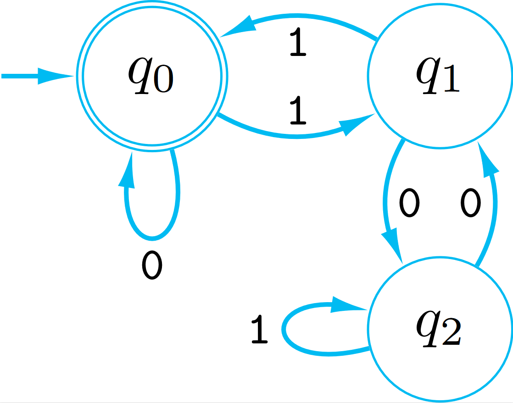

# (1)
Construct an NFA recognising the following languages. Justifications not required.
## (a)
$L=\{w|w\text{ ends with }00\}$

---

Let NFA $M$ recognise $L=L(M)$, $M$ has:
- states $Q=\{q_0,q_1,q_2\}$
- start state $q_0\in Q$
- accept state $A=\{q_2\}$
- transition function $\delta:$
    |Input State|Letter|Output State|
    |---|---|---|
    |$q_0$|$0,a\in\Sigma\neq0$|$q_0$|
    |$q_0$|$0$|$q_1$|
    |$q_1$|$0$|$q_2$|

## (b)
The language $L=L(1^*0^*1^*)$

---
Let NFA $M$ recognise $L=L(M)$, $M$ has:
- states $Q=\{q_0,q_1,q_2,q_3\}$
- start state $q_0\in Q$
- accept states $A=\{q_0, q_3\}$
- transition function $\delta:$
    |Input State|Letter|Output State|
    |---|---|---|
    |$q_0$|$1$|$q_1$|
    |$q_0$|$0$|$q_2$|
    |$q_1$|$1$|$q_1$|
    |$q_1$|$0$|$q_2$|
    |$q_1$|$\epsilon$|$q_3$|
    |$q_2$|$0$|$q_2$|
    |$q_2$|$1$|$q_3$|
    |$q_3$|$1$|$q_3$|

# 2
Convert the following regular expressions to equivalent NFAs. (In each case, break down the given regex into manageable pieces such that you can directly construct a DFA/NFA for each “piece”. Then combine the pieces using the procedures we discussed in class.)
## (a)
$r=(0|1)^*000(0|1)^*$

---
Let $r_0=(0|1)^*,r_1=000$

Let NFA $M_0$ recognise $L(r_0)=L(M_0), M_0$ has:
- state $P=\{p_0\}$
- start state $p_0\in P$
- accept state $A=\{p_0\}$
- transition function $\delta$:
    |Input State|Letter|Output State|
    |---|---|---|
    |$p_0$|$0$|$p_0$|
    |$p_0$|$1$|$p_0$|

Let NFA $M_1$ recognise $L(r_1)=L(M_1), M_0$ has:
- state $Q=\{q_0,q_1,q_2,q_3\}$
- start state $q_0\in Q$
- accept state $A=\{q_3\}$
- transition function $\delta$:
    |Input State|Letter|Output State|
    |---|---|---|
    |$q_0$|$0$|$q_1$|
    |$q_1$|$0$|$q_2$|
    |$q_2$|$0$|$q_3$|

Combining the 3 parts:
Let NFA $M$ recognise $L(r)=L(M), M$ has:
- states $Q=\{p_0,q_0,q_1,q_2,q_3,r_0\}$
- start state $p_0\in Q$
- accept state $A=\{r_0\}$
- transition function $\delta$:
    |Input State|Letter|Output State|
    |---|---|---|
    |$p_0$|$0$|$p_0$|
    |$p_0$|$1$|$p_0$|
    |$p_0$|$\epsilon$|$q_0$|
    |$q_0$|$0$|$q_1$|
    |$q_1$|$0$|$q_2$|
    |$q_2$|$0$|$q_3$|
    |$q_0$|$\epsilon$|$r_0$|
    |$r_0$|$0$|$r_0$|
    |$r_0$|$1$|$r_0$|

## (b)
$r=(((00)^*(11))|01)^*$

---
Let $r_0=(00)^*,r_1=11,r_2=01$

Let NFA $M_0$ recognise $L(r_0)=L(M_0), M_0$ has:
- states $P=\{p_0,p_1\}$
- start state $p_0\in P$
- accept state $A=\{p_0\}$
- transition function $\delta$:
    |Input State|Letter|Output State|
    |---|---|---|
    |$p_0$|$0$|$p_1$|
    |$p_1$|$0$|$p_0$|

Let NFA $M_1$ recognise $L(r_1)=L(M_1), M_1$ has:
- states $Q=\{q_0,q_1,q_2\}$
- start state $q_0\in Q$
- accept state $A=\{q_2\}$
- transition function $\delta$:
    |Input State|Letter|Output State|
    |---|---|---|
    |$q_0$|$1$|$q_1$|
    |$q_1$|$1$|$q_2$|

Let NFA $M_2$ recognise $L(r_2)=L(M_2), M_2$ has:
- states $O=\{o_0,o_1,o_2\}$
- start state $o_0\in O$
- accept state $A=\{o_2\}$
- transition function $\delta$:
    |Input State|Letter|Output State|
    |---|---|---|
    |$o_0$|$0$|$o_1$|
    |$o_1$|$1$|$o_2$|

Let $r_3=((00)^*(11))|01$,\
Combining $M_0,M_1,M_2$.\
Let NFA $M_3$ recognise $L(r_3)=L(M_3), M_3$ has:
- states $Q=\{s,o_0,o_1,o_2,p_0,p_1,q_0,q_1,q_2\}$
- start state $s\in Q$
- accept states $A=\{o_2,q_2\}$
- transition function $\delta$:
    |Input State|Letter|Output State|
    |---|---|---|
    |$s$|$\epsilon$|$o_0$|
    |$s$|$\epsilon$|$p_0$|
    |$p_0$|$0$|$p_1$|
    |$p_1$|$0$|$p_0$|
    |$p_0$|$\epsilon$|$q_0$|
    |$q_0$|$1$|$q_1$|
    |$q_1$|$1$|$q_2$|
    |$o_0$|$0$|$o_1$|
    |$o_1$|$1$|$o_2$|

Now constructing the final NFA for r:\
Let NFA $M$ recognise $L(r)=L(M), M$ has:
- states $Q=\{s,o_0,o_1,o_2,p_0,p_1,q_0,q_1,q_2\}$
- start state $s\in Q$
- accept state $A=\{s\}$
- transition function $\delta$:
    |Input State|Letter|Output State|
    |---|---|---|
    |$s$|$\epsilon$|$o_0$|
    |$s$|$\epsilon$|$p_0$|
    |$p_0$|$0$|$p_1$|
    |$p_1$|$0$|$p_0$|
    |$p_0$|$\epsilon$|$q_0$|
    |$q_0$|$1$|$q_1$|
    |$q_1$|$1$|$q_2$|
    |$o_0$|$0$|$o_1$|
    |$o_1$|$1$|$o_2$|
    |$o_2$|$\epsilon$|$s$|
    |$q_2$|$\epsilon$|$s$|

# 3
## (a)
Convert the following NFA into an equivalent DFA.\
$M$ has:
- states $Q=\{q_0,q_1\}$
- start state $q_0\in Q$
- accept states $A=\{q_0,q_1\}$
- transition function $\delta$:
    |Input State|Letter|Output State|
    |---|---|---|
    |$q_0$|$0$|$q_0$|
    |$q_0$|$0,1$|$q_1$|
    |$q_1$|$1$|$q_1$|

---
Let $N$ be the DFA equal to $M$.\
$N$ has:
- states $P(Q)=\{\empty,\{q_0\},\{q_1\},\{q_0,q_1\}\}$
- start state $\{q_0\}\in P(Q)$
- accept states $A=\{\{q_0\},\{q_1\},\{q_0,q_1\}\}$
- transition function $\delta$:
    |Input State|Letter|Output State|
    |---|---|---|
    |$\{q_0\}$|$0$|$\{q_0,q_1\}$|
    |$\{q_0\}$|$1$|$\{q_1\}$|
    |$\{q_1\}$|$0$|$\empty$|
    |$\{q_1\}$|$1$|$\{q_1\}$|
    |$\{q_0,q_1\}$|$0$|$\{q_0,q_1\}$|
    |$\{q_0,q_1\}$|$1$|$\{q_1\}$|
    |$\empty$|$0$|$\empty$|
    |$\empty$|$1$|$\empty$|

## (b)
Let $L$ be the language of the DFA above. How many equivalence classes does $\sim_L$ have? Justify your answer.

---
from proposition 62 of the book:\
Suppose $M$ is a $DFA$ whose language is $L$. if $x$ and $y$ end at the same state of $M$, then $x\sim_Ly$.\
In the above DFA, $\{q_0\}$ and $\{q_0,q_1\}$ end in the same states of $N$ so $\{q_0\}\sim_L\{q_0,q_1\}$.
The other states have unique output sets so are in their own equivalence classes.\
$\therefore$ the number of equivalence classes in $\sim_L$ is $3$.

# (4)
Let $L$ be the language
$$
L=\{w|\text{ Read in binary, the number $w$ is divisible by }3\}.
$$
Is $L$ recognised by an automaton? If yes, draw an DFA/NFA for L. Otherwise justify why an automaton does not exist.\
We make the convetion that leading 0s do not affect the number. So the number 00011 is the same as the number 11, which is the number three.

---
